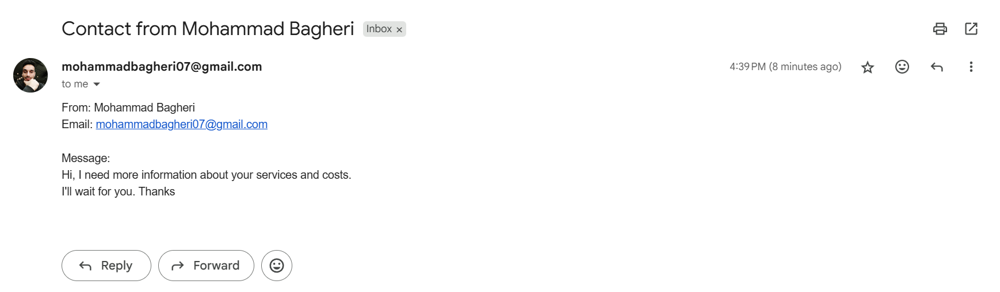

# 🚚 Move it — Full-Stack Moving Service Website

Welcome to **Move it**, a full-stack web application built using **Flask (Python)** and **Bootstrap 5**.  
It features a modern UI, responsive design, and an integrated **email contact form** via SMTP — all deployed on **Render**.

🌐 **Live Preview:**  
👉 [Click here to view the live website](https://moveit-website.onrender.com)
---
##  Project Overview

This project simulates a fictional Italian startup called **Move it**, aiming to offer smooth, stress-free moving services.  
It includes a dynamic backend to support the contact form and a visually rich frontend to engage users.
---
##  Tech Stack

###  Frontend
- HTML5 / CSS3  
- Bootstrap 5.3  
- JS (vanilla + Bootstrap components)  

###  Backend
- Python 3.10  
- Flask 2.3.2  
- Gunicorn 20.1.0  
- SMTP (Gmail) for contact form  
- dotenv for environment variables  

### ☁️ Deployment
- Hosted on [Render.com](https://render.com)  
- `Procfile`, `requirements.txt`, and `runtime.txt` used for server setup  

---
##  Features
- 💡 **Responsive Design** using Bootstrap 5  
- 📧 **Contact Us Form** with email support (via SMTP + Gmail)  
- 🎡 **Carousel for visual storytelling**  
- 🧑‍💼 Professional layout with `Home`, `Services`, and `Quote` sections  
- 🔐 `.env` variables for secure credentials  
- 📨 Asynchronous email sending (with modal feedback)
---

##  Project Screenshots

<table>
  <tr>
    <td></td>
    <td></td>
    <td></td>
    <td></td>  
  </tr>
</table>

---
##  Author
**Mohammad**  
A Data Scientist & ML Enthusiast  who loves learning new things.

GitHub: [@Mohammadbk93](https://github.com/Mohammadbk93)
